# 🛍️ E-commerce Full Stack Application

This is a comprehensive e-commerce full-stack application built using Next.js for the frontend and Node.js with Express.js for the backend. It provides functionality for user authentication, seller product management, and buyer shopping experience.

## 😍 UI


<p align="center">
  <p>Homepage & 404 error page</p>
  <p>
  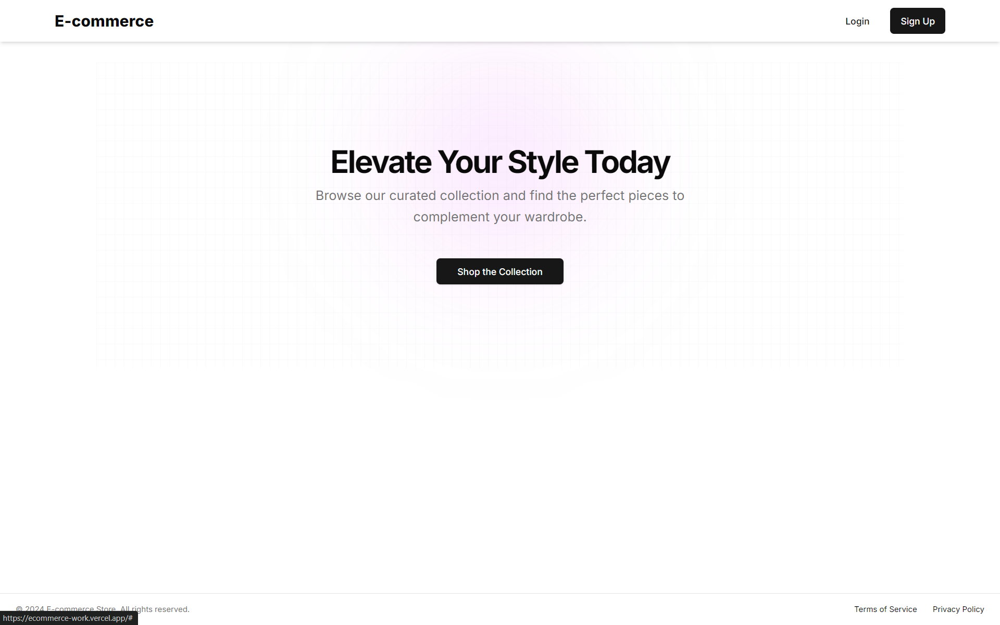
  
  </p>
  <p>Login & Signup Page</p>
  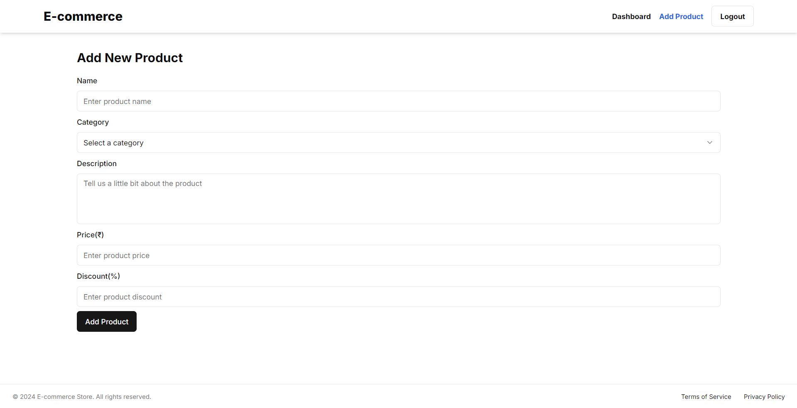
  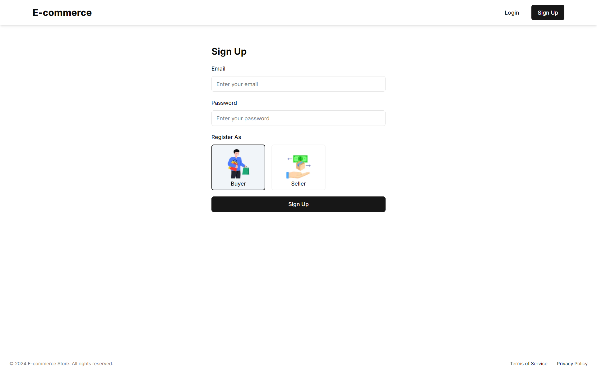
  <p>Login & Signup form validation</p>
  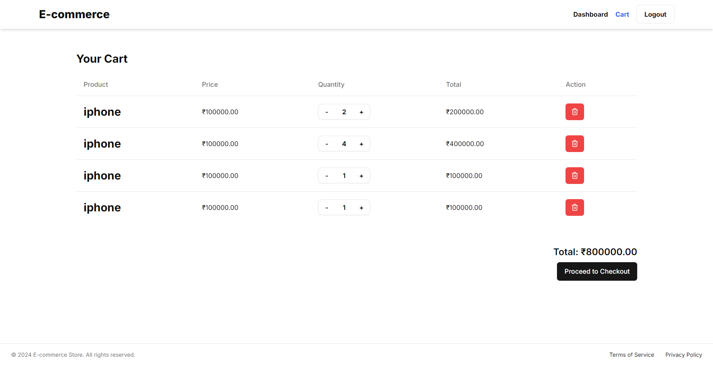
  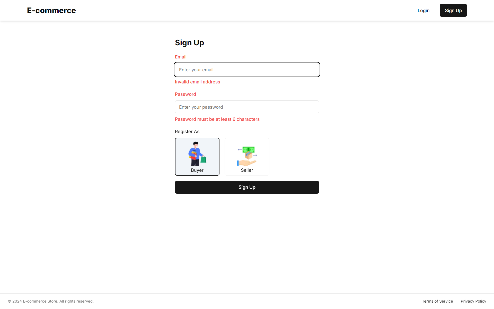
  <p>Buyer & Seller dashboard Page</p>
  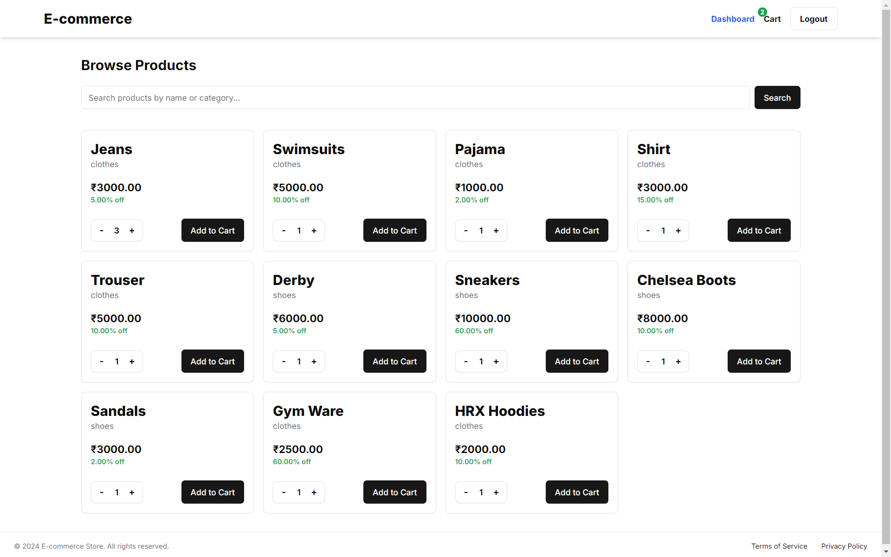
  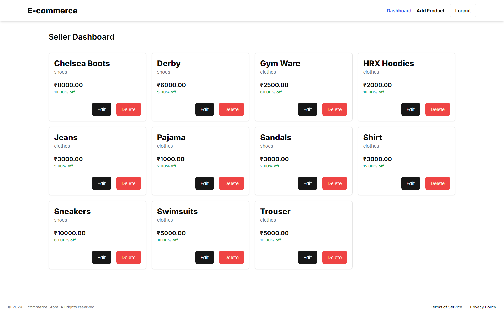
  <p>Advance search functionality for product name & category</p>
  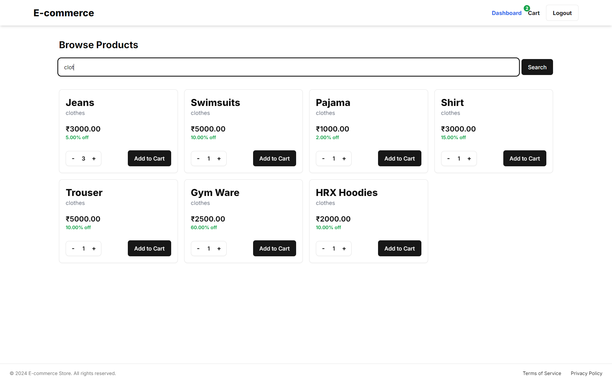
  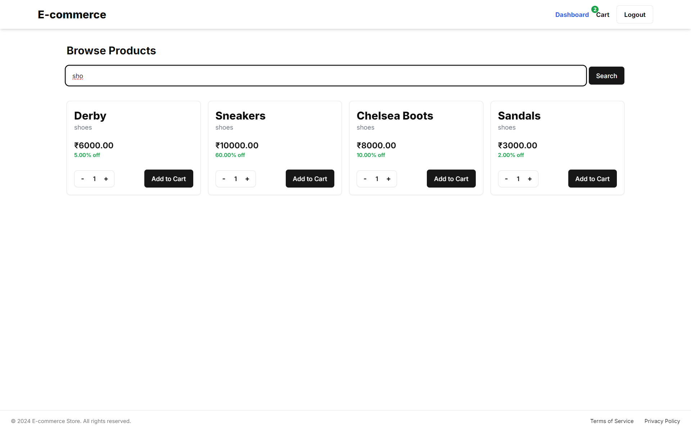
  <p>Fallback loading UI</p>
  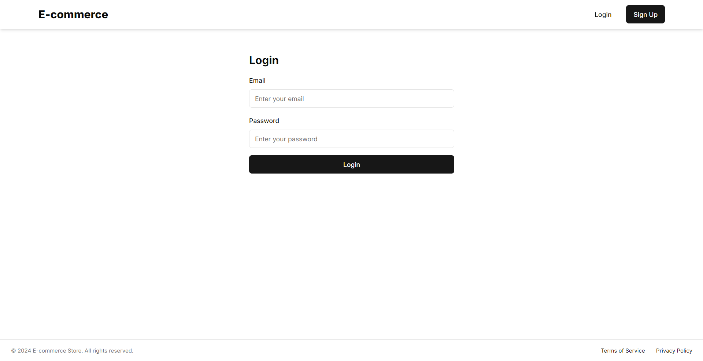
  
  <p>Unauthorize access page for protected routes & Buyer cart page</p>
  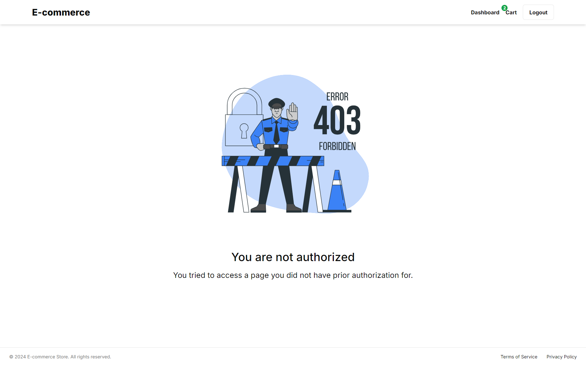
  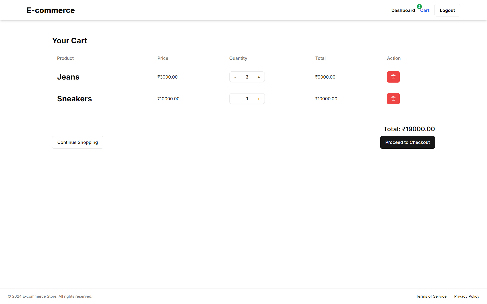
  <p>Seller Add & Edit product page</p>
  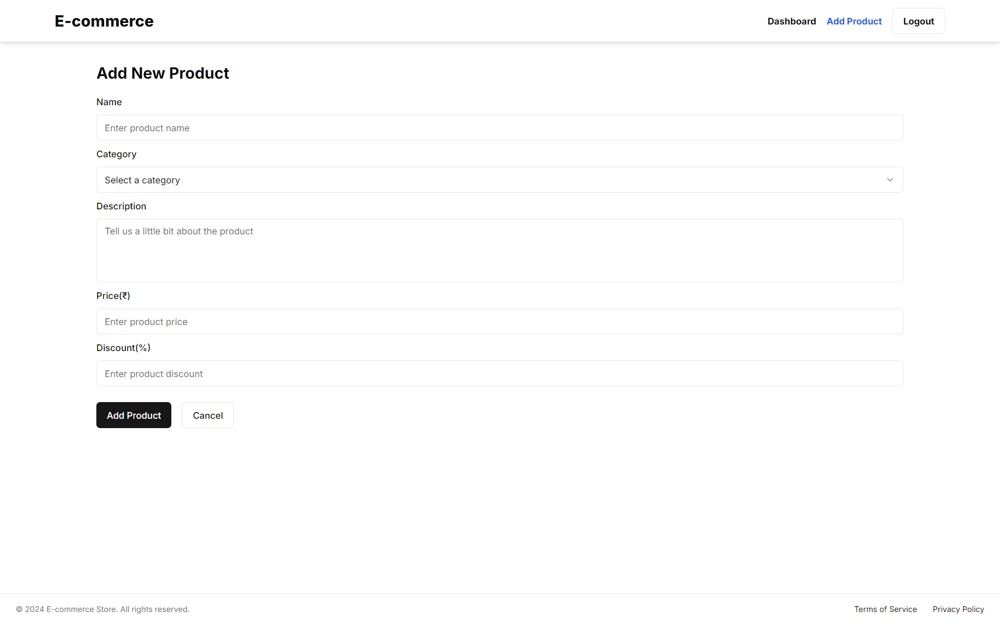
  
  <p>Add & Edit product form fields with custom validation</p>
  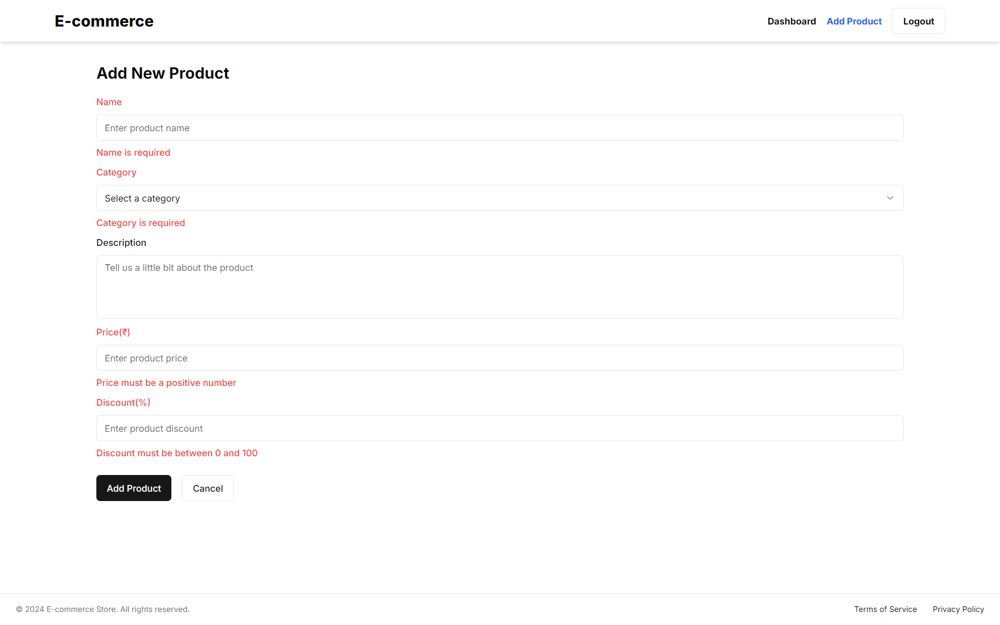
  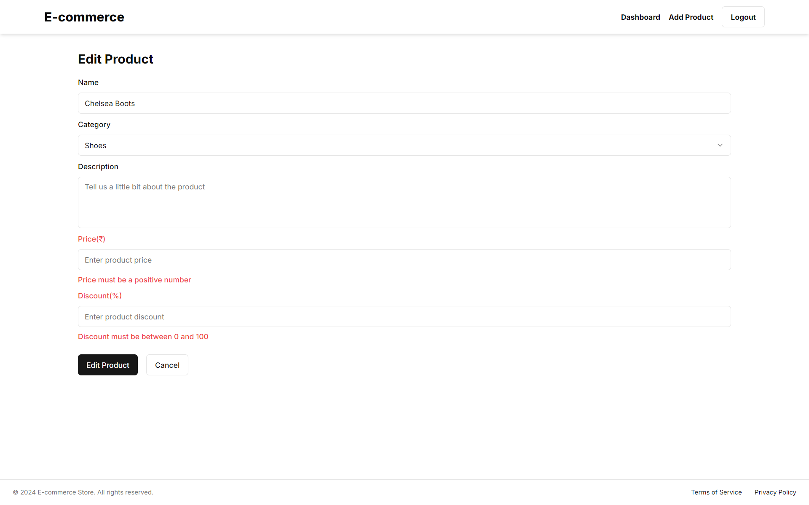
</p>

## 🕹️ Tech Stack

### Frontend
- Next.js 14.2.6
- React 18
- TypeScript
- Tailwind CSS
- Additional libraries:
  - @hookform/resolvers
  - @radix-ui (for UI components)
  - axios (for API requests)
  - react-hook-form (for form handling)
  - zod (for schema validation)
  - zustand (for state management)

### Backend
- Node.js
- Express.js
- PostgreSQL (pg driver)
- Additional libraries:
  - bcryptjs (for password hashing)
  - jsonwebtoken (for JWT authentication)
  - cors (for handling Cross-Origin Resource Sharing)
  - dotenv (for environment variable management)

## 🎉 Features

### User Authentication & Authorization
- Role based dynamic routes based on user login.
- JSON Web Tokens (JWT) used for maintaining user sessions.
- Tokens securely stored on the client-side for persistent authentication.
- Distinct user roles (seller and buyer) with different permissions and access levels.
- Users can create accounts as either sellers or buyers.
- Custom form validation enforced for enhanced security.
- Passwords hashed using bcrypt before storage in the database.
- Handled Unauthorized access for all roles.
- Seamless one click logout feature.

### Seller Functionality
- Sellers can easily add new products with detailed information:
  - Product name
  - Category selection from predefined options
  - Rich text description support
  - Price setting with discount
- Edit existing product details and update information in real-time.
- Remove products from the marketplace with safeguards against accidental deletion.
- Have access for his own added products only.

### Buyer Functionality
- Search functionality allowing users to find products by name or category.
- Implemented advance debounced search functionality for better UI rendering. 
- Sort results automatically by acceding order on every request.
- Buyer can have the flexibility for add to card with quantity directly from product card.
- Remove items or adjust quantities directly from the cart table.
- Persistent cart that saves items for logged-in users across sessions.
- Added cart notification dot with cart count for real time updates.

### Responsive Design

- Fully responsive interface adaptable to various screen sizes (desktop, tablet, mobile).
- Consistent user experience across different devices.

### Security Features

- HTTPS encryption for all data transmissions.
- CSRF protection for form submissions.
- Input validation and sanitization to prevent SQL injection and XSS attacks.

## 🪄 Best Practices

- [✔️] **Input Validation**: All user inputs are validated and sanitized using Zod before being processed or stored in the database.
- [✔️] **Routing**: Next.js file-based routing system is used effectively, with dynamic routes implemented where necessary.
- [✔️] **Responsiveness**: The application is designed to be responsive across various devices and screen sizes using Tailwind CSS.
- [✔️] **Error Handling**: Proper error handling is implemented for various scenarios, with clear and meaningful error messages returned to the client.
- [✔️] **Code Quality**: The codebase maintains high standards of readability and maintainability, with appropriate comments explaining complex logic.
- [✔️] **Security**: Best practices for security are followed, including secure authentication with JWT and bcrypt for password hashing.
- [✔️] **State Management**: Zustand is used for efficient and scalable state management on the frontend.
- [✔️] **Form Handling**: react-hook-form is utilized for efficient and performant form handling.
- [✔️] **API Requests**: Axios is used for making HTTP requests, providing a consistent interface for both browser and node.js environments.
- [✔️] **UI Components**: Shadcn UI is used for accessible and customizable UI components.

## 📦 Setup Instructions

### Frontend Setup

1. Clone and navigate to the client directory:
    ```bash
    git clone https://github.com/debrajhyper/e-commerce.git
    cd e-commerce/client
    ```

2. Install dependencies:
    ```bash
    npm install
    ```

3. Create a .env file in the root of the client directory and add:
    ```bash
    API_BASE_URL=http://localhost:5000/api // Backend server URL
    ```

4. Run the development server:
    ```bash
    npm run dev
    ```

5. Open [http://localhost:3000](http://localhost:3000) in your browser to see the application.

### Backend Setup

1. Navigate to the server directory:
   ```bash
   cd e-commerce/server
   ```

2. Install dependencies:
   ```bash
   npm install
   ```

3. Create a `.env` file in the root of the server directory and add:
   ```bash
    DB_USER=DATABASE_USER
    DB_HOST=DATABASE_HOST
    DB_NAME=DATABASE_NAME
    DB_PASSWORD=DATABASE_PASSWORD
    DB_PORT=DATABASE_PORT
    JWT_SECRET=JWT_SECRET
    AUTH_ROLE_BUYER=buyer
    AUTH_ROLE_SELLER=seller
    PORT=5000
   ```

4. Set up your PostgreSQL database and update the connection string in `.env`.

5. Run the server:
   ```bash
   node serve.js
   ```

## 📃 API Documentation

### Authentication

#### POST /api/auth/signup
Create a new user account.

Request body:
```json
{
  "email": "string",
  "password": "string",
  "role": "seller" | "buyer"
}
```

#### POST /api/auth/login
Log in to an existing account.

Request body:
```json
{
  "email": "string",
  "password": "string"
}
```

Response:
```json
{
  "token": "jwt_token",
}
```

### Products

#### GET /api/products
Get all products.

Response:
```json
[
  {
    "id": "string",
    "name": "string",
    "category": "string",
    "description": "string",
    "price": number,
    "discount": number,
    "sellerId": "string"
  }
]
```

#### GET /api/products/:id
Get a specific product by ID.

Response:
```json
{
    "id": "string",
    "name": "string",
    "category": "string",
    "description": "string",
    "price": "string",
    "discount": "string",
    "sellerId": "string"
}
```

#### POST /api/products
Create a new product (seller only).

Request body:
```json
{
    "name": "string",
    "category": "string",
    "description": "string",
    "price": "string",
    "discount": "string"
}
```

#### PUT /api/products/:id
Update an existing product (seller only).

Request body:
```json
{
    "id": "string",
    "name": "string",
    "category": "string",
    "description": "string",
    "price": "string",
    "discount": "string"
}
```

#### DELETE /api/products/:id
Delete a product (seller only).

### Cart

#### GET /api/cart
Get the current user's cart.

Response:
```json
[
    {
        "id": "string",
        "name": "string",
        "category": "string",
        "description": "string",
        "price": "string",
        "discount": "string",
        "quantity": number,
        "seller_id": number
    }
]
```

#### POST /api/cart
Add a product to the cart.

Request body:
```json
{
  "productId": "string",
  "quantity": number
}
```

#### DELETE /api/cart/:productId
Remove a product from the cart.


## 🗃️ Project Structure

### Frontend (Next.js)
```
client/
├── public/
├── src/
│   ├── app/
│   |   ├── auth/
│   |   |   ├── login/
│   |   |   |   └── page.tsx
│   |   |   └── signup/
│   |   |       └── page.tsx
│   |   ├── buyer/
│   |   |   ├── cart/
│   |   |   |   └── page.tsx
│   |   |   └── dashboard/
│   |   |       └── page.tsx
│   |   ├── seller/
│   |   |   ├── add-product/
│   |   |   |   └── page.tsx
│   |   |   ├── dashboard/
│   |   |   |   └── page.tsx
│   |   |   └── edit-product/
│   |   |       └── page.tsx
│   |   ├── unauthorize/
│   |   ├── layout.tsx
│   |   ├── not-found.tsx
│   |   └── page.tsx
│   ├── components/
│   |   ├── ui/
│   |   ├── DashboardTitle.tsx
│   |   ├── ErrorAlert.tsx
│   |   ├── Footer.tsx
│   |   ├── Header.tsx
│   |   ├── ProductCard.tsx
│   |   ├── ProductCardLoading.tsx
│   |   ├── ProductCount.tsx
│   |   ├── ProductForm.tsx
│   |   └── SearchBar.tsx
│   ├── constants/
│   ├── helpers/
│   ├── hooks/
│   ├── lib/
│   ├── public/
│   ├── store/
│   ├── styles/
│   └── utils/
├── .eslintrc.json
├── next.config.js
├── package.json
├── postcss.config.js
├── tailwind.config.js
└── tsconfig.json
```

### Backend (Node.js)
```
server/
├── config/
│   └── database.js
├── controllers/
│   ├── authController.js
│   ├── cartController.js
│   └── productController.js
├── middleware/
│   └── auth.js
├── models/
│   ├── Cart.js
│   ├── Product.js
│   └── User.js
├── routes/
│   ├── auth.js
│   ├── cart.js
│   └── products.js
├── .env
├── package.json
└── server.js
```


